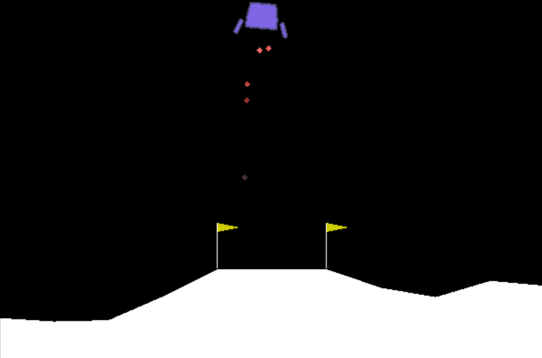

Solution to OpenAI's "LunarLander-v2" environment using the DQN algorithm (implemented in Pytorch).

Main files are:

- **DQN in LunarLander**: Main script for training the agent, along with a visualization of the final agents policy
- **checkpoint.pth**: Weights of a trained network instance. Successful training of the agent by running section 3 in the notebook overriddes this file.

Additional contents are:

- **model.py**: Architecture of the neural network used by the agent
- **dqn_agent.pu**: Agent's and replay buffer classes

The algorithm presents several potential improvements, including prioritized replay and dueling Q-Networks.