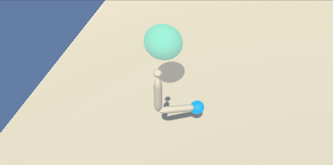
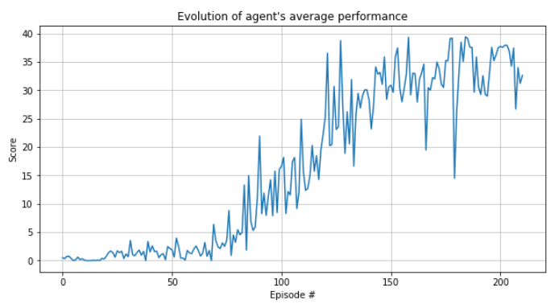

# Deep Q-Learning on Unity environments

-----------

## 1. Overview

Unity [ML-agents](https://github.com/Unity-Technologies/ml-agents) provides a powerful framework for training
and testing AI agents on different environments. 

In this project we train an agent to optimize its interaction with a prebuilt environment. The environment contains a single agent, a robot armed with a single two-jointed arm. Around the agent, a spheric volume moves and shifts positions, while the goal of the agent is to keep the end of the arm inside of the volume at any given timestep. The environment is better described as follows:

- **State space**: The state space dimension `33`, where the dimension corresponds to sensory input including position, rotation, velocity, and angular velocities of the arm. 
- **Action space**: Each action is a vector with `4` numbers, corresponding to torque applicable to two joints. Every entry in the action vector should be a number in the range `[-1, 1]`.
- **Rewards**: A reward of `+0.1` is provided for each step that the agent's hand is in the goal location.The agent, which has 4 possible available actions (moving forward, backward, left and right), 
has to collect as many yellow bananas as possible avoiding blue bananas in each run of the environment (i.e. episode).

See below an actual run of the environment by the succesfuly trained agent:

The agent in this project is trained using a vanilla version of the deep `Deep Deterministic Policy Gradients` algorithm (see [this paper](https://arxiv.org/abs/1509.02971) for reference). Refer to section 4 for technical detail on the agent's configuration and the training algorithm.

-----------

## 2. Working with this project

In this section I describe the technical requirements of this project, along with instructions on how to use available files.

### 2.1. Environment setup

To set up your environment to run this project, follow the below commands from your Anaconda prompt - assuming
you are running on a Windows 10 machine with Anaconda already installed.

**NOTE**: Version conflicts found when pip installing from available wheels created issues when pip installing
the environment from a requirements.txt file. Below commands solve this issue.

1. `conda create -n banana_env python==3.6`
2. `activate banana_env` 
3. `conda install pytorch=1.0.1`
4. `pip install unityagents==0.4.0`

After this you can launch your Jupyter kernel with `jupyter notebook`, and ready to go!

### 2.2. Using the contents of this project

The file `DDPG for continuous control.ipynb` walks the user through the entire project. We can divide it in the following blocks:

1. **The environment and the agent**: Blocks 1 and 2 introduce these concepts and enable the user to see a example episode, with actions chosen at random
2. **Training the agent**: Block 3 runs the algorithm for training the agent, displaying the results of the training process. This step creates the file `trained_agent.pth`, which contains the weights of the agent's optimized Actor network. See section 3.1. of this document for detail on the algorithm and training process
3. **The agent in action**: Block 4 leverages the results from the training process stored in the file `trained_agent.pth` to initialize a trained agent, which we can see in action!

Although the entire project is run from `DDPG for continuous control.ipynb`, we can also find the following files in the project:

- `Reacher_Windows_x86_64`: This folder contains the pre-built Unity environment, operative for Windows 10 64B.
- `DDPG.py`: This file details the classes we leverage on to build and train our agent. These are:
	- `ReplayBuffer`: This class stores the uncorrelated agent's experiences, randomly sampled during the updates of the agent's network
	- `Actor`: The agent's Actor network architecture.
	- `Critic`: The agent's Critic network architecture.
	- `Agent`: The agent's class. This class features a `ReplayBuffer`, two `Actor` and two `Critic` attributes, as well as a variety of methods used to pick actions and learn from previous experience.

See the next section for technical detail on the implemented algorithm.

-----------

## 3. Technical report

This section is the **technical report** for the project, detailing implementation and results

### 3.1. The algorithm

The agent is trained over several episodes, during which it makes decisions based on its current belief and, afterwards,
updates its knolwedge with the observed outcomes of its actions. Agent's belief is represented by a total of `4` neural networks, two `Actor` and two `Critic`.

---

**`Actor` networks** approximates the optimal policy, outputing the optimal action for any given input state `s`. Network architecture used is as follows:

- `2 hidden linear, fully connected layers` of `256` and `128` nodes each with `ELU` activation functions
- Input layer takes in `33` sensory inputs delivered by the agent representing the input state
- Output layer includes `4 linear` nodes with `tanh` activation that deliver the agent's action response in each one of the `4` dimensions of action described in Section 1.

**`Critic` networks** approximates the Q-value of a given input `(s, a)` state-action pair. Network architecture used is as follows:

- `3 hidden linear, fully connected layers` of `256`, `256` and `128` nodes each with `ELU` activation functions
- Input layer takes in `33` sensory inputs delivered by the agent representing the input state
- First hidden layer incorporates `4` extra input nodes (total of `260` nodes) representing the input action
- Output layer includes `1 linear` node that approximates the Q-value of the `(s, a)` input pair.

Both types of networks are instatantited twice, as `local` and `target` networks. While `local` networks are used to compute agent predictions, `target` networks are used to compute loss for the backpropagation steps. This stabilizes the learning proces, such as introduced in the DQN algorithm.

---

The list below describes the algorithm and its parameterization in terms of the steps taken by the agent at each 
point in time during an episode:

1. **Choice of action**: The agent chooses a an optimal action w.r.t. its current policy using it's `local` `Actor` network. To encourage exploration, a noise contribution that decays over time is introduced. This noise is parameterized by the use of two convoluted Weibull distributions.

2. **Update replay buffer**: The `(state, action, reward)` tuple corresponding to the chosen action is stored in a 
memory replay buffer. The replay buffer is initialized with a capacity of `BUFFER_SIZE = 100.000` experiences. When surpassed, older 
experiences are dequed (FIFO) to store new ones.

3. **Learn from past experiences**: Every `UPDATE_EVERY = 5` time steps (action choices), the agent samples a batch of `BATCH_SIZE = 128` random experiences from its buffer. To learn from these uncorrelated experiences, the steps below are followed:

	3.1. *Update `Critic` network*: The Q-value of the end state resulting from the action `a` in state `s` is computed using the `local` `Critic` network. Then, a boostrapped `target` estimate is calculated as the sum of the obtained `reward` and the `GAMMA = 0.99` discounted Q-value of the following `(s', a')` pair. To estimate `a'` the `target` `Actor` network is used, and to estimate the Q-value of `(s', a')` we use the `target` `Critic` network. Afterwards a gradient descent step is executed with `LR_CRITIC = 1e-3` to train the `local` `Critic` network, minimizing the distance between the two Q-values.

	3.3. *Update `Actor` network*: The `local` `Actor` network is then trained to maximize the Q-values of its action, where the `local` `Critic` network is used to obtain the Q-values. Batch gradient descent step is executed with a learning rate of `LR_ACTOR = 5e-4`
    
	3.4. *Soft update of target networks*: Target networks weights are soft-updated as a weighted mean of the local's 
and target's weights for each parameter, using a factor `TAU=0.001`

### 3.2. Agent's performance

The agent solves the environment (i.e. score over 30 in the past 100 episodes) in a total of 211 episodes, with a final
score of 30.08 (section 1 displays a gif showing actual agent's performance in the environment).

The algorithm performs very well in this environment, although time to training can still be optimized by parallelizing experience across several agents. Once this is implemented, some other algorithms could be used as benchmarks including `A3C`.

 
