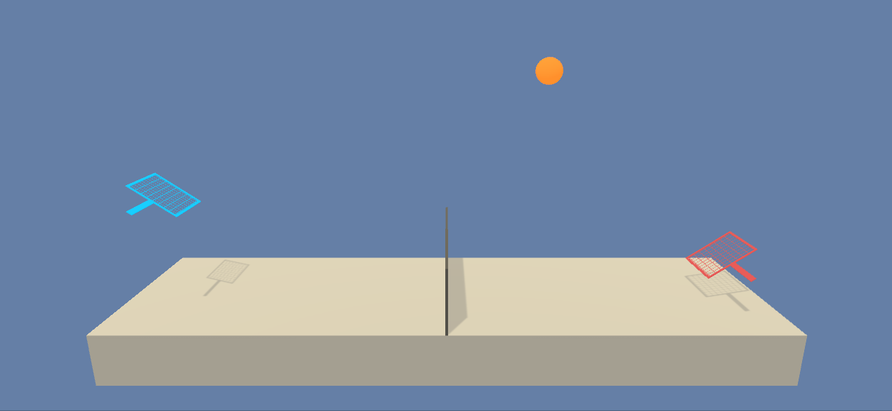
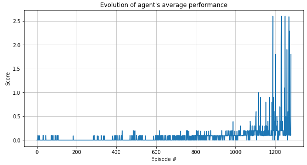

# Multi-Agent Deep Deterministic Policy Gradients in Unity environments

-----------

## 1. Overview

Unity [ML-agents](https://github.com/Unity-Technologies/ml-agents) provides a powerful framework for training and testing AI agents on different environments. 

In this project we train two agents to play tennis. The environment contains two agents, represented by paddles. The environment is best represented as follows:

- **State space**: The state space dimension `8` for each agent. These 8 dimensions represent position and velocity (in `x`, `y`) coordinates for both the agent and the ball. The state representation available in the environment contains 3 stacked state vectors, in order to provide info on the actual progression of the ball. Each agent only have access to their own (local) state observations.
- **Action space**: Two continuous actions are available, corresponding to movement toward (or away from) the net, and jumping.
- **Rewards**: If an agent hits the ball over the net, it receives a reward of `+0.1`. If an agent lets a ball hit the ground or hits the ball out of bounds, it receives a reward of `-0.01`. Thus, the goal of each agent is to keep the ball in play.
- **Episodes**: The task is episodic and the reward is measured as the maximum total reward recieved by any of the agents. The environment is considered solved when a mean score of `+0.5` is achieved over `100` consecutive episodes.

See below an actual run of the environment by the succesfuly trained agents

The agent in this project is trained using a custom implementation of the `Multi-Agent Deep Deterministic Policy Gradients` algorithm. Refer to section 4 for technical detail on the agent's configuration and the training algorithm.

-----------

## 2. Working with this project

In this section I describe the technical requirements of this project, along with instructions on how to use available files.

### 2.1. Environment setup

To set up your environment to run this project, follow the below commands from your Anaconda prompt - assuming
you are running on a Windows 10 machine with Anaconda already installed.

**NOTE**: Version conflicts found when pip installing from available wheels created issues when pip installing
the environment from a requirements.txt file. Below commands solve this issue.

1. `conda create -n tennis_env python==3.6`
2. `activate tennis_env` 
3. `conda install pytorch=1.0.1`
4. `pip install unityagents==0.4.0`

After this you can launch your Jupyter kernel with `jupyter notebook`, and ready to go!

### 2.2. Using the contents of this project

The file `MADDPG for collaboration and competition.ipynb` walks the user through the entire project. We can divide it in the following blocks:

1. **The environment and the agents**: Blocks 1 and 2 introduce these concepts and enable the user to see a example episode, with actions chosen at random
2. **Training the agent**: Block 3 runs the algorithm for training the agents, displaying the results of the training process. This step creates the files `trained_agent_1.pth` and `trained_agent_2.pth`, which contain the weights of the agents' optimized Actor networks. See section 3.1. of this document for detail on the algorithm and training process
3. **The agent in action**: Block 4 leverages the results from the training process stored in the files generated in this last step to initialize a pair of trained agents, which we can see in action!

Although the entire project is run from `MADDPG for collaboration and competition.ipynb`, we can also find the following files in the project:

- `Tennis_Windows_x86_64`: This folder contains the pre-built Unity environment, operative for Windows 10 64B.
- `DDPG.py`: This file details the classes we leverage on to build and train our agents. These are:
	- `ReplayBuffer`: This class stores the uncorrelated agents' experiences, randomly sampled during the updates of the agents' networks
	- `Actor`: Actor network architecture.
	- `Critic`: Critic network architecture.
	- `Agent`: The agent class. This class features a `ReplayBuffer`, two `Actor` and two `Critic` attributes, as well as a variety of methods used to pick actions and learn from previous experience.

See the next section for technical detail on the implemented algorithm.

-----------

## 3. Technical report

This section is the **technical report** for the project, detailing implementation and results

### 3.1. The algorithm

The agents are trained over several episodes, during which they makes decisions based on their current belief and, afterwards,
update their knolwedge with the observed outcomes of their actions. Agent's belief is represented by a total of `4` neural networks, two `Actor` and two `Critic`.

---

**`Actor` networks** approximates the optimal policy, outputing the optimal action for any given input state `s`. Network architecture used is as follows:

- `2 hidden linear, fully connected layers` of `256` nodes each with `ELU` activation functions
- Input layer takes in `24` sensory inputs (`3` stacked state observation vectors) delivered by the agent representing the input state in 3 consecutive frames
- Output layer includes `2 linear` nodes with `tanh` activation that deliver the agent's action response in each one of the `2` dimensions of action described in Section 1.

**`Critic` networks** approximates the Q-value of a given input `(s, a)` state-action pair. For the critic networks, each agent takes as input state observations from both agents, which greatly helps estabilizing the learning 
process in collaborative settings. the Network architecture used is as follows:

- `2 hidden linear, fully connected layers` of `256` nodes each with `ELU` activation functions
- Input layer takes in `48` sensory inputs (`3` stacks of `8` dimensional state observations delivered by each one of the agents) representing the input state
- First hidden layer incorporates `2` extra input nodes (total of `258` nodes) representing the input action
- Output layer includes `1 linear` node that approximates the Q-value of the `(s, a)` input pair.

Both types of networks are instatantited twice for each agent, as `local` and `target` networks. While `local` networks are used to compute agent predictions, `target` networks are used to compute loss for the backpropagation steps. This stabilizes the learning proces, as introduced in the DQN algorithm.

---

The list below describes the algorithm and its parameterization in terms of the steps taken by the agent at each 
point in time during an episode:

1. **Choice of action**: Both agents choose an optimal action w.r.t. their current policies using their `local` `Actor` network. To encourage exploration, a noise contribution that decays over time is introduced. This noise is parameterized by the use of two convoluted Weibull distributions.

2. **Update replay buffer**: The `(state, action, reward, next_state)` tuple corresponding to the chosen action is stored in a 
memory replay buffer, independent for each agent. The replay buffer is initialized with a capacity of `BUFFER_SIZE = 10.000` experiences. When surpassed, older 
experiences are dequed (FIFO) to store new ones. Elements of each stored tuple represent the info for *both* agents.

3. **Learn from past experiences**: Every `UPDATE_EVERY = 1` time steps (action choices), the agents sample a batch of `BATCH_SIZE = 128` random experiences from their own buffer. To learn from these uncorrelated experiences, the steps below are followed by each agent:

	3.1. *Update `Critic` network*: The Q-value of the end state resulting from the action `a` in state `s` is computed using the `local` `Critic` network. Then, a boostrapped `target` estimate is calculated as the sum of the obtained `reward` and the `GAMMA = 0.99` discounted Q-value of the following `(s', a')` pair. To estimate `a'` the `target` `Actor` network is used, and to estimate the Q-value of `(s', a')` we use the `target` `Critic` network. Afterwards a gradient descent step is executed with `LR_CRITIC = 1e-3` to train the `local` `Critic` network, minimizing the distance between the two Q-values.

	3.3. *Update `Actor` network*: The `local` `Actor` network is then trained to maximize the Q-values of its action, where the `local` `Critic` network is used to obtain the Q-values. Batch gradient descent step is executed with a learning rate of `LR_ACTOR = 5e-4`. Note that while the `critic` uses all environmental observation as inputs, `actor` networks only take observation of their own agent.
    
	3.4. *Soft update of target networks*: Target networks weights are soft-updated as a weighted mean of the local's 
and target's weights for each parameter, using a factor `TAU=0.001`

### 3.2. Agent's performance

The agents solve the environment (i.e. score over `0.5` in the past `100` episodes) in a total of `1240` episodes, with a final
score of 0.51 (section 1 displays a gif showing actual trained agents playing tennis).

The learning process seems fairly estable and the agents performance is satisfactory. We can observe interesting behaviors such as repeatedly moving back and forth after hitting the ball (red agent) or performing unnecessary jumps (blue agent). Since the agents are never optimized for efficiency on their actions these behaviors are reasonable. Also, at the time the training stopped the agents were learning at an accelerated rate. Although it could be interesting letting them train for longer to see how much better their performance can get, some sort of timeout should be introduced to limit the time of each episode, while this would affect the density
bad moves to learn from. Further developments should include prioritized replay to fix this potential issue.

 
