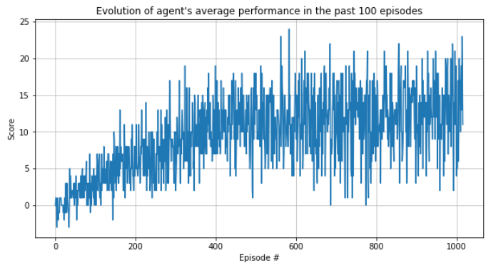

# Deep Q-Learning on Unity environments

-----------

## 1. Overview

Unity [ML-agents](https://github.com/Unity-Technologies/ml-agents) provides a powerful framework for training
and testing AI agents on different environments. 

In this project we train an agent to optimize its interaction with a prebuilt environment, a 3D world in which blue and
yellow bananas spawn at random. The agent, which has 4 possible available actions (moving forward, backward, left and right), 
has to collect as many yellow bananas as possible avoiding blue bananas in each run of the environment (i.e. episode).

See below an actual run of the environment by the succesfuly trained agent:

The agent in this project is trained using a vanilla version of the deep Q-network algorithm (refer to this 
[research paper](https://web.stanford.edu/class/psych209/Readings/MnihEtAlHassibis15NatureControlDeepRL.pdf)). 
Section 4 for technical detail on the agent's configuration and the training algorithm.

-----------

## 2. Working with this project

In this section I describe the technical requirements of this project, along with instructions on how to use available files.

### 2.1. Environment setup

To set up your environment to run this project, follow the below commands from your Anaconda prompt - assuming
you are running on a Windows 10 machine with Anaconda already installed.

**NOTE**: Version conflicts found when pip installing from available wheels created issues when pip installing
the environment from a requirements.txt file. Below commands solve this issue.

1. `conda create -n banana_env python==3.6`
2. `activate banana_env` 
3. `conda install pytorch=1.0.1`
4. `pip install unityagents==0.4.0`

After this you can launch your Jupyter kernel with `jupyter notebook`, and ready to go!

### 2.2. Using the contents of this project

The file `DQN in the Banana environment.ipynb` walks the user through the entire project. We can divide it in the following sections:

1. **The environment and the agent**: Sections 1 and 2 introduce these concepts and enable the user to see a example episode, with actions chosen at random
2. **Training the agent**: Section 3 runs the algorithm for training the agent, displaying the results of the training process. This step creates the file `checkpoint.pth`, which contains the weights of the agent's optimized Q-network. See the [technical report](### 3.1. The algorithm) for detail on the algorithm and training process
3. **The agent in action**: Section 4 leverages the results from the training process stored in the file `checkpoint.pth` to initialize a trained agent, which we can see in action!

Although the entire project is run from `DQN in the Banana environment.ipynb`, we can also find the following files in the project:

- `Banana_Windows_x86_64`: This folder contains the pre-built Unity environment, operative for Windows 10 64B.
- `dqn_agent.py`: This file details the classes we leverage on to build and train our agent. These are:
	- `ReplayBuffer`: This class stores the uncorrelated agent's experiences, randomly sampled during the updates of the agent's network
	- `Q-Network`: The agent's Q-network architecture.
	- `Agent`: The agent's class. This class features a `ReplayBuffer` and two `Q-Network` attributes, as well as a variety of methods used to pick actions and learn from previous experience.

See the next section for technical detail on the implemented algorithm.

-----------

## 3. Technical report

This section is the **technical report** for the project, detailing implementation and results

### 3.1. The algorithm

The agent is trained over several episodes, during which it makes decisions based on its current belief and, afterwards,
updates its knolwedge with the observed outcomes of its actions. Agent's belief is represented by two neural networks 
(i.e. local and target) with identical architecture. **Neural network architecture** used is as follows:

- `3 hidden, fully connected layers` of `256`, `512`, and `256` nodes each with `ReLU` activation functions
- Input layer takes in `37` sensory inputs delivered by the agent
- Output layer includes `4 linear` nodes to model the Q-values of each one of the `4` actions available to the agent

The list below describes the algorithm and its parameterization in terms of the steps taken by the agent at each 
point in time during an episode:

1. **Choice of action**: The agent chooses an epsilon-greedy action w.r.t. its current policy. Specifically, the environment state
is passed onto the local network, delivering estimates for the Q-value of each possible action. The agent picks the action with
the highest Q-value with a probability `1-epsilon` where `epsilon` is the exploration parameter for the agent. This hyper-parameter
is initialized with a value of `1`, decaying a `5%` of its current value in each episode up to a minimum of `0.01`.

2. **Update replay buffer**: The `(state, action, reward)` tuple corresponding to the chosen action is stored in a 
memory replay buffer. The replay buffer is initialized with a capacity of `BUFFER_SIZE = 100.000` experiences. When surpassed, older 
experiences are dequed (FIFO) to store new ones.

3. **Learn from past experiences**: Every `UPDATE_EVERY = 4` time steps (action choices), the agent samples a batch of `BATCH_SIZE = 64` random
experiences from its buffer. To learn from these uncorrelated experiences, the steps below are followed:

	3.1. *Compute local predictions (predicted values)*: The Q-value of the end state resulting from each action 
(max Q-value across all possible future actions in t+1) is estimated using the target network. These values are 
discounted with `GAMMA = 0.99` and added to the observed reward resulting from each action. 
	
	3.2. *Compute target predictions (target values)*: Target Q-values are computed on a forward pass for the target
network for the sampled experiences
	
	3.3. *Update weights of local network*: The local network is updated in a batch gradient descent step for the
sampled experiences, using a learning rate of `LR = 5e-4`
	
	3.4. *Soft update of target network*: Target network weights are soft-updated as a weighted mean of the local's 
and target's weights for each parameter, using a factor `TAU=0.001`

### 3.2. Agent's performance

The agent solves the environment (i.e. score over 13 in the past 100 episodes) in a total of 917 episodes, with a final
score of 13.03 (section 1 displays a gif showing actual agent's performance in the environment).

It can be observed in the performance evolution chart how the average performance rapidly plateaus after ~400 episodes
and how the episode level performance is highly variable. While the current algorithm adequalty solves the environment,
several improvements have been identified as applicable, including double Q-networks, prioritized replay and dueling 
Q-networks, which are expected to significantly improve agent's performance.

 
